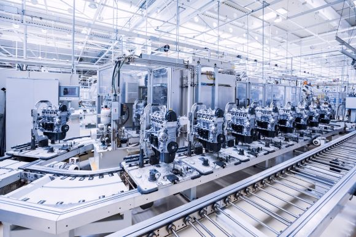
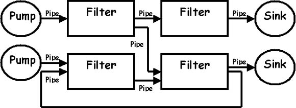
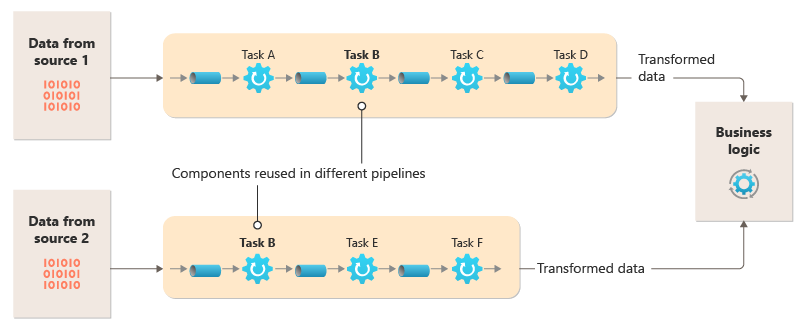

# 🎓 Seminário: Arquitetura Pipe & Filter

## 1. Introdução à Arquitetura Pipe & Filter 🚀

A arquitetura **Pipe & Filter** é amplamente utilizada no desenvolvimento de sistemas, principalmente quando há necessidade de processar fluxos de dados de forma sequencial. O conceito básico envolve a divisão do processamento em etapas, cada uma representada por um "filtro", e os dados fluem entre essas etapas através de "pipes" (tubulações).

> **Exemplo:** Pense em uma linha de produção em uma fábrica, onde cada estação realiza uma transformação específica em um item, e esse item é passado de uma estação para outra até estar finalizado.

---

## 2. Teoria e Explicação da Arquitetura 🧠

A **Arquitetura Pipe & Filter** é composta por dois elementos principais:

- **Filtros (Filters):** São unidades independentes responsáveis por uma transformação específica nos dados. Cada filtro recebe dados de entrada, processa-os, e envia a saída para o próximo filtro.
- **Pipes (Tubes):** São canais que transportam os dados de um filtro para outro.

Esta arquitetura oferece uma abordagem modular, onde cada filtro pode ser substituído ou modificado sem afetar o resto do sistema. Isso facilita a manutenção e escalabilidade.

> **Nota:** Um exemplo clássico de Pipe & Filter é encontrado nos sistemas Unix, onde comandos são encadeados com pipes (`|`), permitindo que a saída de um comando seja usada como entrada do próximo.

---

## 3. Objetivos da Arquitetura 🎯

Os principais objetivos da **Arquitetura Pipe & Filter** incluem:

- **Modularidade:** Permitir que partes do sistema sejam desenvolvidas e mantidas de forma independente.
- **Reuso de Componentes:** Facilitar o reaproveitamento de filtros em diferentes sistemas ou cenários.
- **Facilidade de Teste:** Cada filtro pode ser testado de forma isolada.
- **Composição Flexível:** Filtros podem ser facilmente reorganizados ou combinados para formar novos fluxos de processamento.

> 🔍 **Exemplo:** Em uma aplicação de processamento de imagens, podemos ter um filtro para redimensionar a imagem, outro para aplicar um filtro de cor e outro para comprimir a imagem. A ordem desses filtros pode ser alterada dependendo da necessidade.

---

## 4. Aplicabilidade e Limitações 📊

### Onde Utilizar? ✅

A arquitetura **Pipe & Filter** é ideal para:

- Sistemas que processam dados de forma sequencial ou em estágios.
- Aplicações de processamento de dados, como sistemas ETL (Extract, Transform, Load).
- Ferramentas de processamento de texto e dados, como compiladores.

### Onde Evitar? ❌

Pode não ser a escolha ideal em sistemas que:

- Exigem alta interação entre os componentes, pois a comunicação unidirecional dos pipes pode ser uma limitação.
- Têm forte dependência entre as etapas do processamento, onde a ordem de execução não pode ser facilmente alterada.

> **Exemplo:** Se um sistema precisa que o resultado de um filtro influencie um processamento anterior, a arquitetura Pipe & Filter pode não ser adequada, pois os pipes normalmente seguem uma comunicação "só de ida".

---

## 5. Fitness Functions 🏋️

As **Fitness Functions** em uma arquitetura Pipe & Filter são métricas usadas para medir o sucesso da implementação da arquitetura. As métricas comuns incluem:

- **Latência do Processamento:** Tempo que os dados levam para passar por todos os filtros.
- **Utilização de Recursos:** O quão eficiente é a utilização de CPU e memória em cada filtro.
- **Escalabilidade:** Capacidade de adicionar novos filtros ou aumentar a carga de dados sem degradação significativa do desempenho.

📊 **Exemplo de Métrica:** Em um sistema de processamento de vídeo, uma fitness function pode medir o tempo total de processamento de um vídeo do começo ao fim, comparando diferentes ordens de filtros (e.g., compressão antes de aplicar filtros de cor).

---

## 6. Conclusão 🎯

A arquitetura **Pipe & Filter** oferece uma abordagem modular e eficiente para o processamento de dados em etapas, com grande flexibilidade e facilidade de manutenção. No entanto, não é adequada para todos os tipos de sistemas, especialmente aqueles que exigem forte interação ou dependência entre as etapas.

👉 **Dica Final:** Para projetos que envolvem processamento sequencial de dados, como sistemas ETL ou de processamento de imagens, a arquitetura Pipe & Filter é uma excelente escolha devido à sua modularidade e facilidade de composição.

---

*Agradecemos sua atenção!*